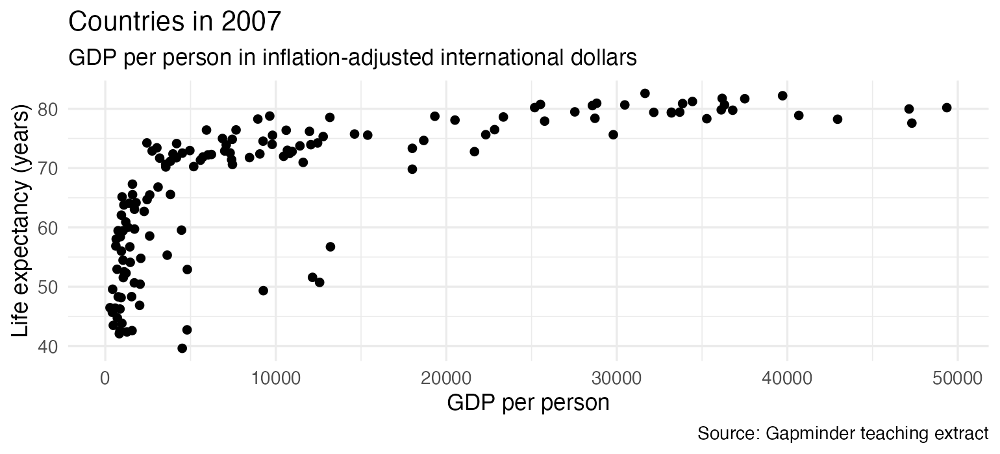

## A course project

Replace the examples below with work you can explain.

### Question

How did life expectancy vary across countries in 2007?

### Evidence and method

The [Gapminder teaching extract](https://jennybc.github.io/gapminder/) contains country observations from 1952 to 2007. We filter to 2007 and compare country values.

### Result

Source: Gapminder teaching extract. This example chart is supplied from Week 3. Replace it with your own work when ready.

### Interpretation

Write a sentence describing a pattern and a sentence stating a relevant limitation. Country averages do not describe every individual.
